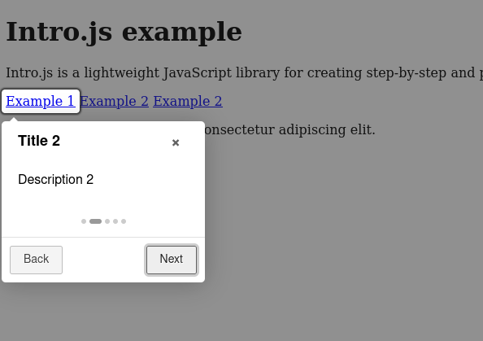

# Basic example of using intro.js

Intro.js is a lightweight JavaScript library for creating step-by-step and powerful customer onboarding tours

All documentation in: <a href="https://introjs.com/">https://introjs.com/</a>

## Capture

## Demo in:

<a href="#">...</a>
